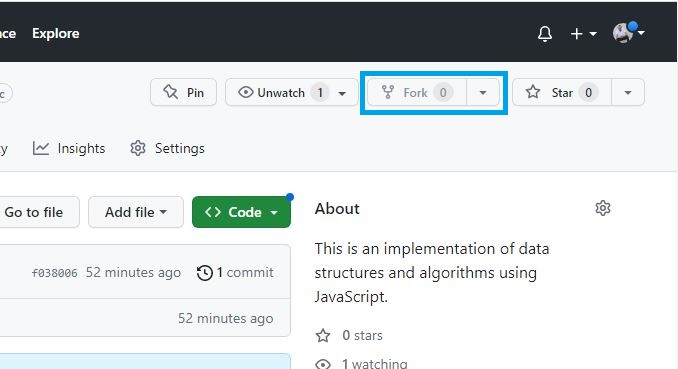

# CONTRIBUTING

To start your first contribution to this repository, you need to initialize your git basic commands before anything. However, this only applies if you haven't already set up your git environment.

## SET UP GIT ENVIRONMENT

### Initiaze Git

```
git -init
```
### 1. Configure your local Git information

```
git config --global user.name "Your GitHub UserName"
```

```
git config --global user.email "Your Email Address"
```

## ADD YOURSELF TO CONTRIBUTORS LIST

### * Fork the repository




